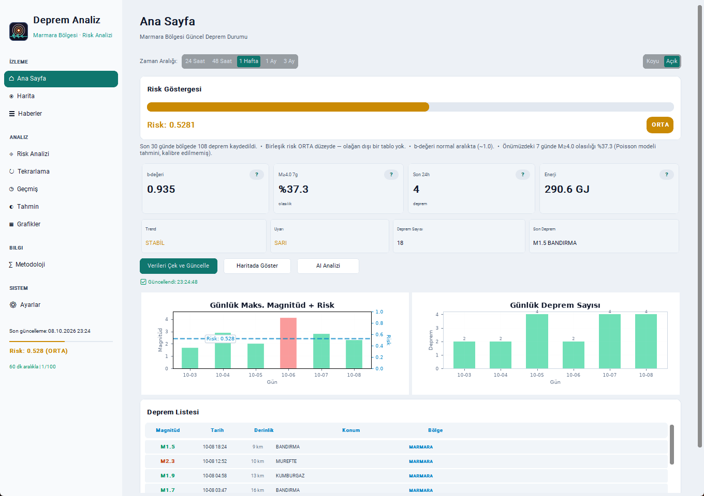

# Deprem Analiz — Marmara

**Marmara Denizi ve İstanbul çevresindeki deprem kayıtlarını takip etmek, görselleştirmek ve istatistiksel olarak incelemek için geliştirilmiş Windows masaüstü uygulaması.**


[](https://github.com/canyrtcn/deprem-analiz-marmara/releases/tag/v1.0.1)

Python, CustomTkinter ve SQLite tabanlı uygulama; deprem kayıtlarını yerel olarak saklar, harita ve grafikler üzerinden sunar, uygun veri koşullarında istatistiksel göstergeler hesaplar ve isteğe bağlı Telegram bildirimleri sağlar.

> [!IMPORTANT]
> **Deprem erken uyarı sistemi değildir.** Depremlerin ne zaman, nerede veya hangi büyüklükte gerçekleşeceğini güvenilir biçimde öngördüğü iddia edilmez. Olasılık olarak gösterilen değerler, varsayımlara bağlı **kalibre edilmemiş model çıktılarıdır**; bileşik aktivite/risk puanları ise olasılık değildir. Acil durumlarda ve resmî bilgilendirmelerde [AFAD](https://www.afad.gov.tr/) ile [Kandilli Rasathanesi](https://www.koeri.boun.edu.tr/) duyurularını esas alın.

## Uygulama görünümü



*Arayüz tanıtımındaki deprem kayıtları ve metrikler **sentetik demo verileridir**. Gerçek ölçüm, güncel sismik durum veya operasyonel tahmin olarak yorumlanmamalıdır.*

## Özellikler

| Alan | Açıklama |
| --- | --- |
| **Deprem takibi** | Sismik Harita API ve Kandilli/KOERI kaynaklarından kayıt çekme; kaynağa ve zamana göre inceleme |
| **Harita** | Gömülü Marmara haritası, deprem noktaları, sayısallaştırılmış fay çizgileri, yakınlaştırma ve etkileşim |
| **Risk ve aktivite göstergeleri** | Deprem sıklığı, büyüklük, derinlik ve diğer istatistiklerden oluşturulan açıklamalı bileşik göstergeler |
| **İstatistiksel analiz** | Gutenberg–Richter b-değeri, büyüklük-frekans dağılımı, katalog tamlığı ve Poisson modeli |
| **Artçı aktivitesi** | Uygun anaşok ve büyüklük türü koşullarında Omori temelli model çıktıları |
| **Grafikler ve geçmiş** | Zaman serileri, büyüklük/derinlik dağılımları, enerji, eğilimler ve dönemsel raporlar |
| **Bildirimler** | Kullanıcı tarafından yapılandırılan eşiklere göre Telegram bildirimleri ve bildirim geçmişi |
| **Arayüz** | Açık/koyu tema, metodoloji açıklamaları ve yerel veriyle çevrimdışı inceleme |

Haritadaki fay çizgileri bilgilendirme amaçlı sayısallaştırılmış/şematik gösterimler içerir; resmî fay konumu, afet riski veya mühendislik değerlendirmesi yerine geçmez.

## İndirme ve kurulum

### Windows için hazır paket

**[Son sürüm: v1.0.1 — GitHub Releases](https://github.com/canyrtcn/deprem-analiz-marmara/releases/tag/v1.0.1)**

1. `deprem-analiz-marmara-win64.zip` paketini indirin.
2. ZIP arşivini bilgisayarınızda yazma izniniz olan bir klasöre çıkarın.
3. Klasördeki `deprem-analiz-marmara.exe` dosyasını çalıştırın. Ayrı bir kurulum sihirbazı gerekmez.
4. İlk açılışta sunulan API/ayarlar rehberini izleyin. API anahtarı zorunlu değildir; anahtarsız kullanımda sağlayıcının kota sınırları uygulanabilir.

> **Sürüm yükseltirken:** Mevcut `data/` klasörünüzü yedekleyin. Yeni paketi açtıktan sonra, verilerinizin yeni uygulama klasöründe korunmasını sağlayın; eski klasörü veya kişisel veri dosyalarını kontrol etmeden silmeyin. Release ZIP'i kullanıcı verilerini içermez.

**Not:** Depo şu anda özel (*private*) erişimdedir. Release bağlantısını açmak için depoya erişim yetkisi gerekebilir.

### Kaynak koddan çalıştırma

Python 3.10 veya daha yeni bir Python 3 sürümü önerilir.

```bash
python -m pip install -r requirements.txt
python run_gui.py
```

Komut satırı üzerinden örnek işlemler:

```bash
python main.py fetch --days 7
python main.py update
python main.py report
python main.py history weekly
python main.py backfill
```

Kullanılabilir diğer seçenekler için `python main.py --help` komutunu çalıştırın.

## Veri kaynakları ve hesaplamaların yorumlanması

- **Kayıt kaynakları:** [Sismik Harita](https://sismikharita.com) ve [Kandilli/KOERI](https://www.koeri.boun.edu.tr/). Kaynakların güncellik, erişilebilirlik, büyüklük türü ve revizyon uygulamaları farklı olabilir. Ağ hatası, “deprem yok” sonucuyla aynı değildir.
- **Büyüklük türleri:** ML, Mw ve MD farklı ölçümlerdir. Uygulama bu türleri bilimsel dönüşüm yapmadan birbirine eşdeğer kabul etmez. Bazı kaynak/tür ayrımları mevcut v1 veritabanında tam olarak korunmaz.
- **Poisson modeli:** Katalog yeterliliği ve gözlem aralığı koşullarına bağlı, kalibre edilmemiş istatistiksel olasılıklar sağlar; fiziksel deprem tehlikesi tahmini değildir.
- **Bileşik skor:** Görsel karşılaştırma için kullanılan boyutsuz bir aktivite/risk göstergesidir. Yüzdelik deprem olasılığı olarak okunmamalıdır.
- **Omori modeli:** Her kayıt için geçerli değildir; doğrulanmış Mw türünde, Mw ≥ 5.9 uygun anaşok koşulu aranır.
- **Coulomb açıklamaları:** Arayüzdeki basitleştirilmiş gösterim, doğrulanmış bir ΔCFF çözümü veya deprem tetikleme hesabı değildir.
- **Eksik veri:** Yeterli ve uygun kayıt bulunmadığında uygulama bazı sayısal alanları hesaplamaz; “—” veya “yetersiz veri” gösterebilir.

Bu proje bilimsel kavramları erişilebilir kılmayı ve deprem verisini incelemeyi amaçlar; resmî tehlike haritası, erken uyarı hizmeti veya afet kararı destek sistemi değildir.

## Telegram bildirimleri

Telegram kullanımı isteğe bağlıdır. Ayarlar ekranından yapılandırılabilir veya terminalde gizli token girişiyle kurulabilir:

```bash
python main.py telegram-setup
```

Bot tokenını `--token` gibi komut satırı parametrelerine yazmayın. Gönderim durumu, başarılı/başarısız/atlanan işlemleri ayırt edecek şekilde raporlanır. Gerçek mesaj gönderebilmek için ağ erişimi ve geçerli Telegram bilgileri gerekir.

## Güncelleme ve bilinen sınırlamalar

- **v1.0.1'de otomatik güncelleme indirme/kurma devre dışıdır.** Yeni sürüm denetimi bilgi vermek içindir. Yeni paketi GitHub Releases üzerinden elle edinin.
- Depo özel erişimdeyken güncelleme denetimi başarısız olabilir veya “Denetlenemedi” gösterebilir; bu, yeni sürümün bulunmadığının kanıtı değildir.
- Mevcut dağıtım **v1 SQLite şemasıyla** çalışır. Yeni olay/gözlem/sürüm veritabanı mimarisine canlı geçiş bu sürümde etkin değildir.
- Bazı gelişmiş istatistiksel modüllerin ve veri akışlarının bilinen sınırlamaları bulunmaktadır; çıktılar bilimsel uzman değerlendirmesinin yerine geçmez.
- Uygulama, mevcut kayıtları ağ bağlantısı olmadan görüntüleyebilir; yeni deprem verilerinin indirilmesi için ilgili kaynaklara bağlantı gerekir.

Önceki sürümler ve değişiklik açıklamaları için [Releases](https://github.com/canyrtcn/deprem-analiz-marmara/releases) sayfasına bakın.

## Gizlilik ve yerel veriler

Uygulama hesap açmayı veya konum takibini gerektirmez. Deprem veritabanları, ayarlar ve bildirim kayıtları yerel `data/` dizininde (gerekirse yazılabilir kullanıcı veri dizininde) tutulur. `data/settings.json` Git tarafından hariç tutulur; **Git tarafından hariç tutulması dosyanın şifrelendiği anlamına gelmez.** API anahtarlarını, Telegram kimlik bilgilerini ve yedekleri özel tutun; gerçek veri dosyalarını GitHub'a yüklemeyin.

| Ortam değişkeni | Amaç |
| --- | --- |
| `DEPREM_TELEGRAM_TOKEN` | Telegram bot tokenı |
| `DEPREM_TELEGRAM_CHAT_ID` | Telegram hedef sohbet kimliği |
| `DEPREM_START_PAGE` | GUI açılış sayfası (örn. `harita`) |
| `DEPREM_DEV=1` | Yerel geliştirme modu; üretim kullanımı için önerilmez |

## Geliştirme ve paketleme

```bash
python -m pip install -r requirements.txt
python -m pip install pyinstaller
python build.py
python build.py --release
```

`python build.py`, `dist/` altında taşınabilir Windows uygulamasını üretir. `--release` seçeneği ayrıca ZIP oluşturur; **GitHub'a otomatik olarak release yayımlamaz**. Dağıtım ZIP'ine `data/` kullanıcı klasörü eklenmez.

Ana modüller `deprem_izleme/` paketinde; GUI giriş noktası `run_gui.py`, CLI `main.py`, paketleyici `build.py` dosyasındadır.

## Kaynaklar ve atıflar

- Deprem katalogları: [Sismik Harita](https://sismikharita.com), [Kandilli Rasathanesi](https://www.koeri.boun.edu.tr/).
- Coğrafi çizgiler: [Natural Earth](https://www.naturalearthdata.com/); fay gösterimleri için MTA verilerinden sayısallaştırılmış kaynaklar ve [ozangerger/earthquakes-in-istanbul](https://github.com/ozangerger/earthquakes-in-istanbul).
- Yöntemsel arka plan: Gutenberg & Richter (1944); Aki (1965); Utsu (1966); Gardner & Knopoff (1974); Reasenberg & Jones (1989); Wiemer & Wyss (2000); Jordan vd. (2011, [doi:10.4401/ag-5350](https://doi.org/10.4401/ag-5350)); Müderrisoğlu & Yazgan (2020, [doi:10.1007/s11803-020-0553-2](https://doi.org/10.1007/s11803-020-0553-2)).

Bu atıflar uygulamanın sonuçlarının ilgili çalışmalarda doğrulandığı veya resmî kurumlarca onaylandığı anlamına gelmez.

## Lisans

Kaynak kod [MIT Lisansı](LICENSE) altında lisanslanmıştır. Depo şu anda özel erişimdedir.

